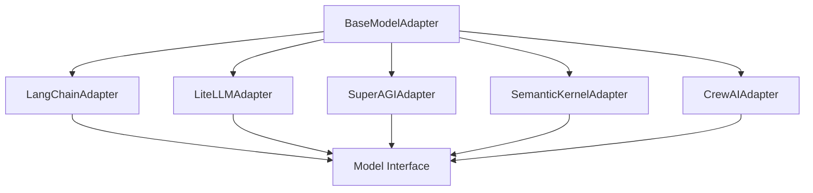
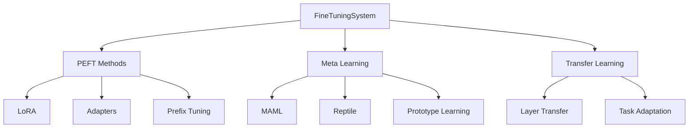
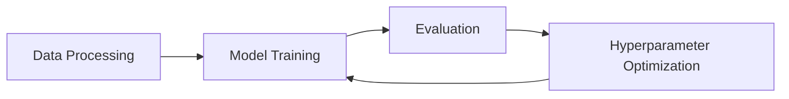

# MultiMind SDK Architecture

This document provides a detailed overview of the MultiMind SDK architecture, its components, and how they interact.

## System Overview

MultiMind SDK is built with a modular, extensible architecture that enables efficient fine-tuning and adaptation of language models. The system is organized into several key components:

### Core Components

1. **Model Adapters**
   - Framework-specific adapters (LangChain, LiteLLM, etc.)
   - Unified interface for model interaction
   - Automatic device management (CPU/GPU)
   - Resource optimization

2. **Fine-Tuning System**
   - PEFT methods implementation
   - Meta-learning framework
   - Transfer learning capabilities
   - Multi-task learning support

3. **Training Pipeline**
   - Data processing and preparation
   - Model training and evaluation
   - Hyperparameter optimization
   - Checkpoint management

## Component Details

### 1. Model Adapters Layer

#### Key Features:
- Abstract base class for all adapters
- Framework-specific implementations
- Common interface for model operations
- Automatic resource management

### 2. Fine-Tuning System

#### PEFT Methods:
- **LoRA**: Low-rank adaptation for efficient fine-tuning
- **Adapters**: Task-specific adapter layers
- **Prefix Tuning**: Learnable prefix vectors
- **IA³**: Infused adapter by inhibiting and amplifying inner activations

#### Meta-Learning:
- **MAML**: Model-Agnostic Meta-Learning
- **Reptile**: Simple meta-learning algorithm
- **Prototype Learning**: Few-shot classification

#### Transfer Learning:
- Layer-wise similarity analysis
- Automatic layer selection
- Multi-task transfer support

### 3. Training Pipeline

#### Components:
1. **Data Processing**
   - Dataset loading and preprocessing
   - Task-specific data formatting
   - Few-shot episode generation
   - Data augmentation

2. **Model Training**
   - Training loop implementation
   - Gradient computation
   - Optimization strategies
   - Checkpoint management

3. **Evaluation**
   - Performance metrics
   - Task-specific evaluation
   - Cross-validation
   - Model comparison

4. **Hyperparameter Optimization**
   - Meta-learning based optimization
   - Task-specific parameter tuning
   - Resource-aware adaptation
   - Performance tracking

## Data Flow

### Training Process
1. Data ingestion and preprocessing
2. Model initialization and adapter setup
3. Training loop execution
4. Evaluation and metric computation
5. Hyperparameter optimization
6. Model checkpointing

### Inference Process
1. Model loading and adapter initialization
2. Input preprocessing
3. Model inference
4. Output postprocessing
5. Result formatting

## Resource Management

### Memory Optimization
- Gradient checkpointing
- Mixed precision training
- Efficient data loading
- Model sharding

### GPU Utilization
- Automatic device selection
- Batch size optimization
- Memory-efficient training
- Multi-GPU support

## Extension Points

### Adding New Components
1. **New PEFT Method**
   - Implement method-specific adapter
   - Add to PEFT registry
   - Update documentation

2. **New Framework Adapter**
   - Extend BaseModelAdapter
   - Implement required methods
   - Add to adapter factory

3. **New Meta-Learning Strategy**
   - Implement strategy class
   - Add to meta-learning registry
   - Update training pipeline

## Security Considerations

### Model Security
- Secure model loading
- Input validation
- Output sanitization
- Access control

### Data Security
- Secure data handling
- Privacy-preserving training
- Data encryption
- Access logging

## Performance Considerations

### Optimization Strategies
- Batch processing
- Caching mechanisms
- Parallel processing
- Resource pooling

### Scalability
- Distributed training
- Model parallelism
- Data parallelism
- Resource scaling

## Future Architecture

### Planned Components
1. **Distributed Training**
   - Multi-node support
   - Model parallelism
   - Data parallelism

2. **Advanced Meta-Learning**
   - Neural architecture search
   - Automated hyperparameter tuning
   - Multi-task optimization

3. **Model Serving**
   - REST API
   - gRPC support
   - Model versioning
   - A/B testing

## Dependencies

### Core Dependencies
- PyTorch
- Transformers
- PEFT
- Optuna
- NumPy

### Optional Dependencies
- LangChain
- LiteLLM
- SuperAGI
- Semantic Kernel
- CrewAI

## Configuration

### System Configuration
- Environment variables
- Configuration files
- Runtime settings
- Resource limits

### Model Configuration
- Model parameters
- Training settings
- Optimization options
- Evaluation metrics 