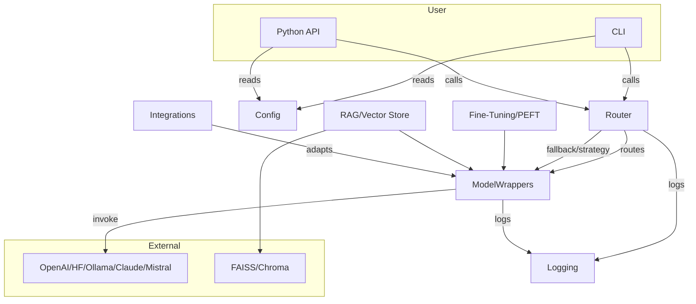

# MultiMind SDK: Features & Functions

## Project Structure (Current & Planned)

Below is the planned modular structure for MultiMind SDK. **Modules marked as [implemented] are available now; others are planned for future releases.**

```
multimind-sdk/
├── multimind/
│   ├── __init__.py
│   ├── config.py                   # [implemented] Central config loader
│
│   ├── models/                    # [implemented] Unified model wrappers
│   │   ├── base.py                # [implemented]
│   │   ├── openai.py              # [implemented]
│   │   ├── claude.py              # [planned]
│   │   ├── mistral.py             # [planned]
│   │   ├── huggingface.py         # [implemented]
│   │   └── ollama.py              # [implemented]
│
│   ├── router/                    # [implemented] Fallback, latency-aware, cost-aware logic
│   │   ├── strategy.py            # [implemented]
│   │   ├── fallback.py            # [implemented]
│   │   └── router.py              # [implemented]
│
│   ├── rag/                       # [implemented] Retrieval-Augmented Generation support
│   │   ├── base.py                # [implemented]
│   │   ├── embedder.py            # [implemented]
│   │   └── vector_store.py        # [implemented]
│
│   ├── fine_tuning/              # [implemented] Training logic
│   │   ├── lora_trainer.py        # [implemented]
│   │   ├── qlora_trainer.py       # [implemented]
│   │   └── dataset_loader.py      # [implemented]
│
│   ├── agents/                   # [planned] Agent abstraction
│   │   ├── agent.py               # [planned]
│   │   ├── memory.py              # [planned]
│   │   ├── agent_loader.py        # [planned]
│   │   └── tools/
│   │       ├── web_search.py      # [planned]
│   │       ├── calculator.py      # [planned]
│   │       └── file_reader.py     # [planned]
│
│   ├── orchestration/           # [planned] Prompt chaining and flow control
│   │   ├── prompt_chain.py        # [planned]
│   │   └── task_runner.py         # [planned]
│
│   ├── mcp/                     # [planned] Model Composition Protocol
│   │   ├── parser.py             # [planned]
│   │   ├── executor.py           # [planned]
│   │   └── schema.json           # [planned]
│
│   ├── integrations/           # [implemented] Compatibility with LangChain, CrewAI, etc.
│   │   ├── langchain_adapter.py   # [implemented]
│   │   ├── crewai_adapter.py      # [implemented]
│   │   └── lite_llm.py           # [implemented]
│
│   ├── logging/
│   │   ├── trace_logger.py        # [planned]
│   │   └── usage_tracker.py       # [planned]
│
│   ├── cli/
│   │   ├── main.py                # [implemented] multimind CLI entry
│   │   └── commands/
│   │       ├── agent.py           # [planned]
│   │       ├── run_mcp.py         # [planned]
│   │       └── finetune.py        # [planned]
│
├── examples/
├── configs/                    # [implemented] Sample config files (e.g., train_config.yaml)
├── tests/                      # [implemented]
├── README.md
├── LICENSE
├── pyproject.toml
├── setup.py
```

> **Note:** This structure is forward-looking. All [implemented] modules are available now; [planned] modules will be added in future releases. Current functionality is not impacted.

---

## Overview

MultiMind SDK is a modular, extensible framework for parameter-efficient fine-tuning, inference, and management of large language models (LLMs) across multiple providers. It supports advanced routing, logging, configuration, and integration with popular agent and orchestration frameworks.

---

## Core Features

### Model Support
- **Model Wrappers:**
  - OpenAI (GPT)
  - HuggingFace (any compatible model)
  - Ollama (local models)
  - [Planned/Extensible] Anthropic Claude, Mistral, and others
- **Unified Interface:** All wrappers support `generate`, `chat`, and `embeddings` (where applicable).

### Routing & Strategy
- **Model Router:**
  - Strategy-based routing (cost-aware, latency-aware, hybrid)
  - Fallback chain for robust inference
  - Dynamic model selection

### Fine-Tuning & PEFT
- **PEFT Methods:**
  - LoRA, Adapters, Prefix/Prompt Tuning, IA³, BitFit, QLoRA, Compacter, HyperLoRA, UniPELT, MAM, and more
- **Meta-Learning:**
  - Few-shot (MAML, Reptile, Prototype)
  - Transfer learning
  - Multi-task adaptation
- **RAG (Retrieval-Augmented Generation):**
  - Vector store support (FAISS, Chroma)
  - Embedding and retrieval utilities

### Logging & Monitoring
- **Centralized Logging:**
  - Token usage, cost, latency, and errors
  - Configurable output (console, file, etc.)

### Configuration
- **Config Management:**
  - YAML/JSON config files
  - `.env` and environment variable support for secrets
  - CLI and SDK share config logic

### CLI & Integration
- **CLI:**
  - Train, evaluate, infer, list, download, export, delete, config, info, completion
  - Interactive prompts for missing arguments
- **Framework Integrations:**
  - LangChain, CrewAI, LiteLLM, SuperAGI, Semantic Kernel
  - Adapter classes for seamless use in agent frameworks

---

## Architecture Overview

- **Model Wrappers**: Abstract base + provider-specific classes
- **Router**: Strategy, fallback, and dynamic selection
- **Fine-Tuning**: Modular PEFT, meta-learning, and RAG
- **Logging**: Centralized, pluggable
- **Config**: Unified loader, validation, and secrets management
- **CLI**: Click-based, extensible, test-covered
- **Integrations**: Adapter pattern for external frameworks

---

## Flow Chart



---

## Feature Table

| Category         | Feature/Functionality                                      | Status         |
|------------------|-----------------------------------------------------------|----------------|
| Model Wrappers   | OpenAI, HuggingFace, Ollama, (Claude/Mistral: planned)    | Implemented/Extensible |
| Routing          | Strategy, fallback, dynamic selection                     | Implemented    |
| Logging          | Token usage, cost, latency, errors                        | Implemented    |
| Config           | YAML/JSON, .env, env vars, validation                     | Implemented    |
| CLI              | All major commands, interactive, test-covered             | Implemented    |
| Fine-Tuning/PEFT | LoRA, Adapters, Prefix, Prompt, IA³, BitFit, QLoRA, etc.  | Implemented    |
| Meta-Learning    | Few-shot, transfer, multi-task                            | Implemented    |
| RAG              | FAISS, Chroma, embedding, retrieval                       | Implemented    |
| Integrations     | LangChain, CrewAI, LiteLLM, SuperAGI, Semantic Kernel     | Implemented    |

---

## Extensibility
- New model providers can be added by subclassing the base wrapper.
- New routing strategies and logging sinks are pluggable.
- CLI and config are designed for easy extension.

---

For more details, see the [Architecture Overview](architecture.md) and [Development Guide](development.md). 