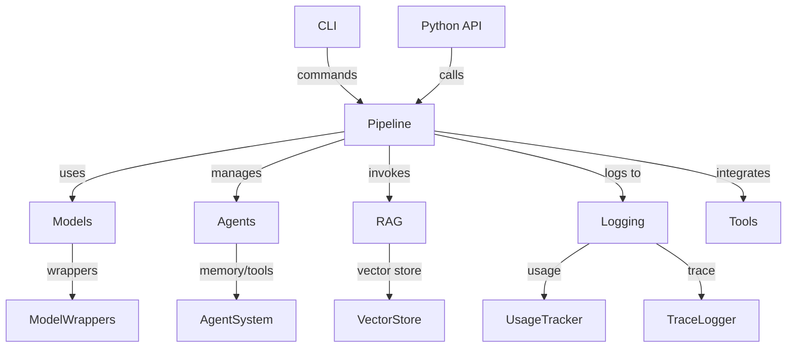

# Architecture

MultiMind SDK is designed with modularity and extensibility in mind. The architecture enables seamless integration of models, agents, RAG, and orchestration workflows.

## Core Components
- **Pipeline:** Orchestrates model workflows, agent logic, and RAG operations.
- **Modules:** Model wrappers, agent system, RAG engine, CLI, logging, and integrations.
- **Utils:** Configuration management, environment loading, and utility functions.

## Flow Diagram

This modular design allows for easy extension and integration with external tools and workflows. 