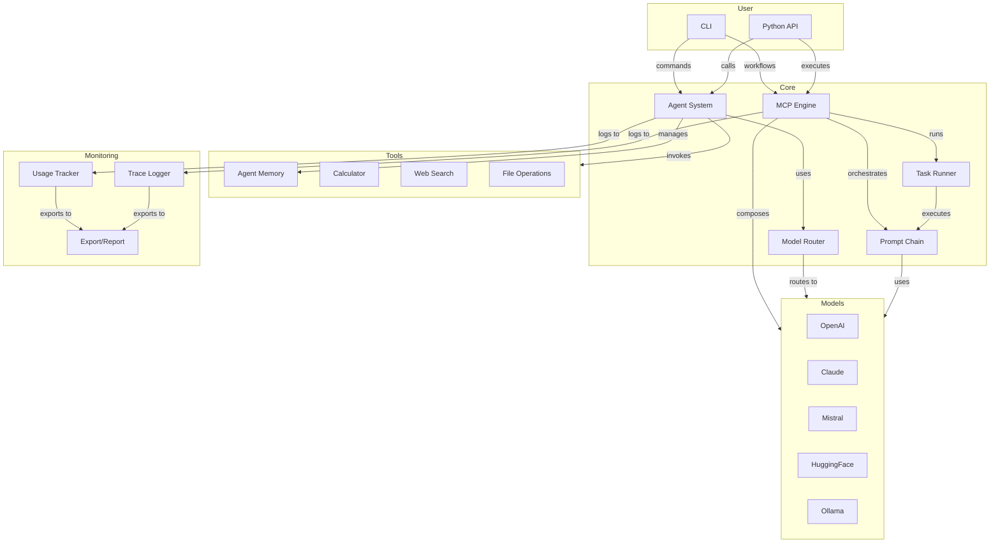

# Architecture Overview

MultiMind SDK is designed for modularity, extensibility, and developer productivity. The architecture enables seamless integration of models, agents, RAG, and orchestration workflows.

## High-Level Diagram

## Main Components
- **Agent System:** Manages agent logic, memory, and tool use.
- **RAG Engine:** Handles document ingestion, embedding, and retrieval.
- **Model Router:** Selects the best model for each task.
- **Orchestration:** Enables prompt chaining and workflow execution.
- **Monitoring:** Tracks usage, logs traces, and exports reports.

For more details, see the [Features](../features/core-features.md) and [API Reference](../api/rag-api.md). 